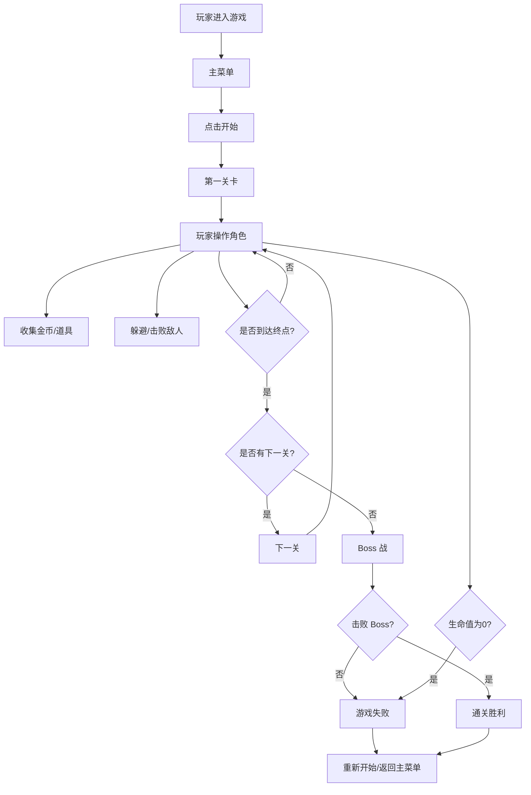

## 1. 产品概述

一款基于 Phaser.js 开发的经典超级玛丽风格横版动作游戏，玩家操控主角在像素风格的世界中冒险，收集金币、击败敌人、获取道具，最终挑战 Boss 通关。

- 核心目标：还原经典横版跳跃游戏的乐趣，提供完整的游戏体验
- 目标用户：喜欢经典像素游戏的休闲玩家

## 2. 核心功能

### 2.1 功能模块

1. **主菜单场景**：游戏标题、开始按钮、操作说明
2. **游戏场景**：关卡地图、角色控制、敌人、道具、金币
3. **Boss 战场景**：Boss 战斗、特殊机制
4. **游戏结束场景**：胜利/失败界面、重新开始

### 2.2 游戏元素详情

| 类别 | 元素名称 | 功能描述 |
|------|----------|----------|
| 玩家角色 | 马里奥 | 左右移动、跳跃、下蹲、发射火球（获取道具后） |
| 敌人 | 蘑菇怪 (Goomba) | 左右巡逻，被踩死或被火球消灭 |
| 敌人 | 乌龟 (Koopa) | 左右巡逻，被踩后变成龟壳可推动 |
| 道具 | 超级蘑菇 | 使角色变大，可承受一次伤害 |
| 道具 | 火焰花 | 使角色可以发射火球 |
| 道具 | 金币 | 收集加分，100个加一条命 |
| 地形 | 砖块 | 可顶碎（变大状态下） |
| 地形 | 问号块 | 顶出金币或道具 |
| 地形 | 水管 | 装饰/传送（部分） |
| Boss | 库巴 | 关卡最终 Boss，需要踩火球或特定方式击败 |

## 3. 核心流程

## 4. 用户界面设计

### 4.1 设计风格

- **整体风格**：经典 8-bit 像素风格，复古怀旧
- **主色调**：天空蓝（背景）、绿色（管道/草地）、红色（主角）、棕色（砖块）
- **像素风格**：16x16 或 32x32 像素网格，色彩鲜明
- **字体**：像素风格字体，增强复古感

### 4.2 界面元素

| 界面 | 元素 | 说明 |
|------|------|------|
| 主菜单 | 游戏标题 | 大号像素字体，带闪烁动画 |
| 主菜单 | 开始按钮 | 居中，hover 有缩放效果 |
| 游戏 HUD | 分数 | 左上角显示 |
| 游戏 HUD | 金币数 | 分数下方显示 |
| 游戏 HUD | 生命值 | 右上角显示 |
| 游戏 HUD | 世界/关卡 | 中上显示 |
| 结束界面 | 结果文字 | 胜利/失败大字 |
| 结束界面 | 重玩按钮 | 居中 |

### 4.3 操作方式

- **键盘操作**：
  - 方向键 ← → 或 A/D：左右移动
  - 方向键 ↑ 或 W 或 空格：跳跃
  - 方向键 ↓ 或 S：下蹲
  - Shift 或 J：发射火球（有火焰花时）
  - Enter：开始/暂停

### 4.4 响应式设计

- 桌面端优先，支持全屏
- 游戏画布保持 16:9 比例自适应
- 移动端可添加虚拟按键（后续扩展）
