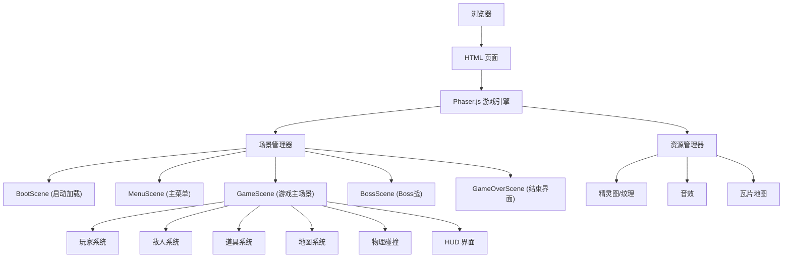

## 1. 架构设计



## 2. 技术选型

- **游戏引擎**：Phaser 3.x - 成熟的 2D HTML5 游戏框架，内置物理引擎、动画系统、场景管理
- **构建工具**：Vite - 快速的开发服务器和构建工具
- **语言**：TypeScript - 类型安全，更好的代码提示和可维护性
- **样式**：原生 CSS - 简单的页面布局
- **素材生成**：
  - 代码绘制：使用 Phaser Graphics API 生成像素风格图形
  - AI 生成：使用 text_to_image API 生成关键角色/场景素材

## 3. 项目目录结构

```
mario/
├── index.html              # 入口 HTML
├── package.json            # 项目配置
├── tsconfig.json           # TypeScript 配置
├── vite.config.ts          # Vite 配置
├── public/                 # 静态资源
│   └── assets/             # 游戏素材
│       ├── sprites/        # 精灵图
│       ├── tiles/          # 瓦片图
│       └── audio/          # 音效
└── src/
    ├── main.ts             # 入口文件
    ├── game/
    │   ├── config.ts       # 游戏配置
    │   ├── Game.ts         # 游戏主类
    │   └── types.ts        # 类型定义
    ├── scenes/             # 场景
    │   ├── BootScene.ts
    │   ├── MenuScene.ts
    │   ├── GameScene.ts
    │   ├── BossScene.ts
    │   └── GameOverScene.ts
    ├── entities/           # 游戏实体
    │   ├── Player.ts       # 玩家
    │   ├── Goomba.ts       # 蘑菇怪
    │   ├── Koopa.ts        # 乌龟
    │   ├── Boss.ts         # Boss
    │   ├── Coin.ts         # 金币
    │   ├── Mushroom.ts     # 蘑菇道具
    │   ├── FireFlower.ts   # 火焰花
    │   └── Fireball.ts     # 火球
    ├── systems/            # 游戏系统
    │   ├── CollisionSystem.ts   # 碰撞系统
    │   ├── LevelSystem.ts       # 关卡系统
    │   └── ScoreSystem.ts       # 分数系统
    ├── utils/              # 工具函数
    │   ├── AssetGenerator.ts    # 代码素材生成器
    │   └── InputManager.ts      # 输入管理
    └── ui/                 # UI 组件
        └── HUD.ts          # 游戏 HUD
```

## 4. 核心模块设计

### 4.1 场景系统

| 场景名称 | 职责 | 关键方法 |
|----------|------|----------|
| BootScene | 预加载资源、初始化配置 | preload(), create() |
| MenuScene | 主菜单界面、开始游戏 | create(), update() |
| GameScene | 游戏主逻辑、关卡渲染 | create(), update(), render() |
| BossScene | Boss 战斗逻辑 | create(), update() |
| GameOverScene | 胜利/失败界面、重玩 | create() |

### 4.2 玩家系统

- **状态机**：小马里奥 / 大马里奥 / 火焰马里奥
- **物理属性**：重力、跳跃力、移动速度
- **动画**：站立、行走、跳跃、下蹲、死亡
- **碰撞**：与地面、砖块、敌人、道具的碰撞检测

### 4.3 关卡系统

- 使用瓦片地图 (Tilemap) 存储关卡数据
- 支持多关卡切换
- 关卡元素：地面、砖块、问号块、水管、金币、敌人出生点

### 4.4 碰撞系统

基于 Phaser Arcade Physics：
- 玩家 vs 地形（平台碰撞）
- 玩家 vs 敌人（踩头/受伤）
- 玩家 vs 道具（拾取）
- 火球 vs 敌人（消灭）
- 龟壳 vs 敌人（撞击）

## 5. 技术要点

### 5.1 像素风格渲染

- 游戏画布：800x450 (16:9)，像素缩放模式
- 瓦片大小：32x32 像素
- 禁用图像平滑，保持像素锐利

### 5.2 相机系统

- 跟随玩家水平滚动
- 边界限制（不超过关卡左右边界）
- 垂直方向固定（经典马里奥视角）

### 5.3 性能优化

- 对象池：复用敌人、火球、粒子
- 视口剔除：只渲染可见区域的瓦片
- 合理的物理碰撞检测范围

## 6. 素材方案

### 6.1 代码生成素材（主要）

使用 Phaser Graphics API 动态绘制：
- 地形瓦片（砖块、地面、水管）
- 简单道具（金币、蘑菇）
- 背景元素（云朵、远山）

### 6.2 AI 生成素材（关键角色）

使用 AI 生成像素风格：
- 主角马里奥（多帧动画）
- 敌人（蘑菇怪、乌龟）
- Boss 库巴
- 火焰花等复杂道具
